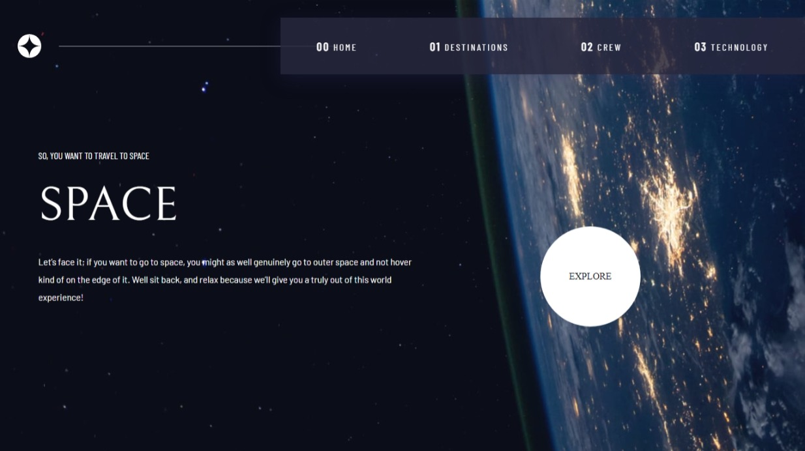
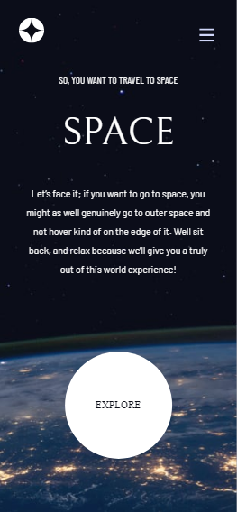

# Frontend Mentor - Space tourism website solution

This is a solution to the [Space tourism website challenge on Frontend Mentor](https://www.frontendmentor.io/challenges/space-tourism-multipage-website-gRWj1URZ3). Frontend Mentor challenges help you improve your coding skills by building realistic projects. 

## Table of contents

- [Overview](#overview)
  - [The challenge](#the-challenge)
  - [Screenshot](#screenshot)
  - [Links](#links)
- [My process](#my-process)
  - [Built with](#built-with)
  - [What I learned](#what-i-learned)
  - [Continued development](#continued-development)
  - [Useful resources](#useful-resources)
- [Author](#author)
- [Acknowledgments](#acknowledgments)

## Overview

### The challenge

Users should be able to:

- View the optimal layout for each of the website's pages depending on their device's screen size
- See hover states for all interactive elements on the page
- View each page and be able to toggle between the tabs to see new information

### Web Screenshot

### Mobile Screenshot

### Links

- Solution URL: [Add solution URL here](https://github.com/code-pace/space-tourism)
- Live Site URL: [Add live site URL here](https://your-live-site-url.com)

## My process

### Built with

- Semantic HTML5 markup
- CSS custom properties
- Flexbox
- Mobile-first workflow
- [React](https://reactjs.org/) - JS library

### What I learned

During the course of building this space tourism web pages, I learn't that state management is indeed a required process of organizing data in react, it was not strictly implemented in this project as I have drafted it out for future learning 😞, secondly learnt intensively react-router-dom in accordance with the new update on it's current version.

### Useful resources

This time around, I decided to write a google free react app practice, though references to my notes where made 🤪.

## Author

- Frontend Mentor - [@code-pace](https://www.frontendmentor.io/profile/code-pace)
- Twitter - [@code_pace](https://www.twitter.com/code_pace)

## Acknowledgments

I'm deeply grateful to those behind frontend mentor, building such a project stretched my bands of scope in react libraby.
